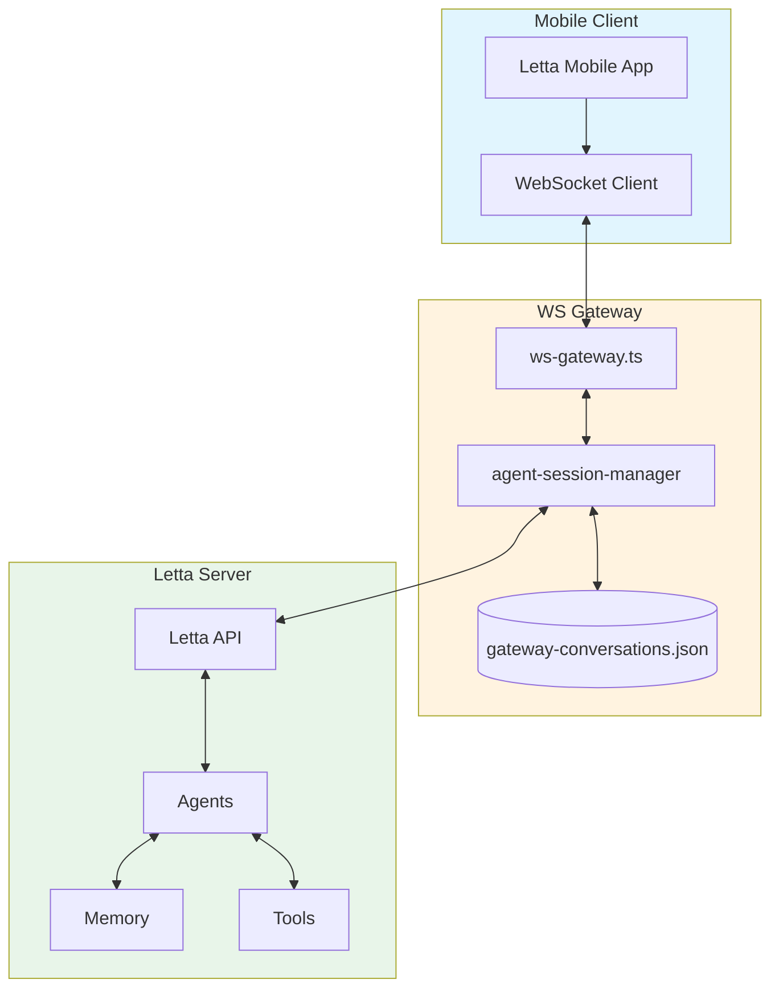
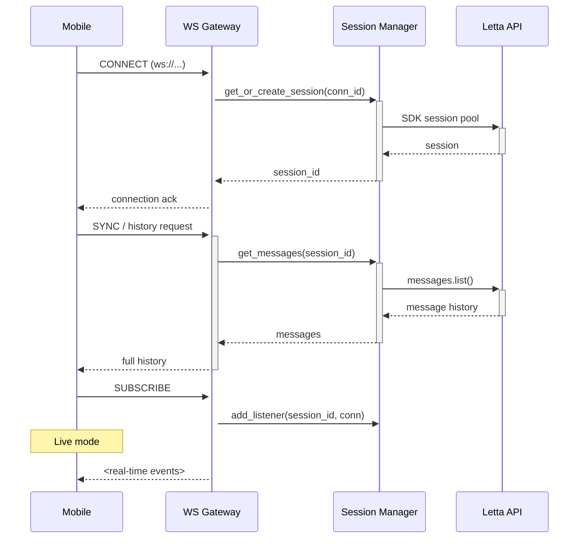
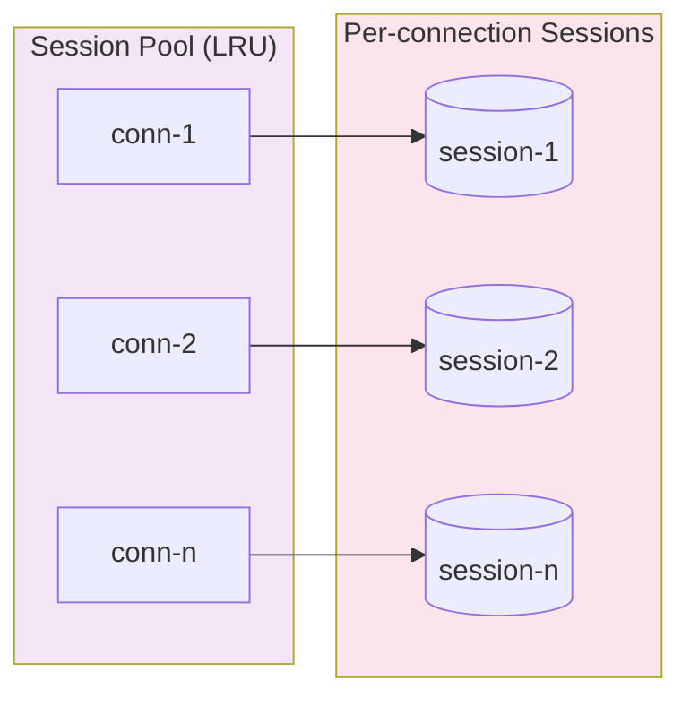
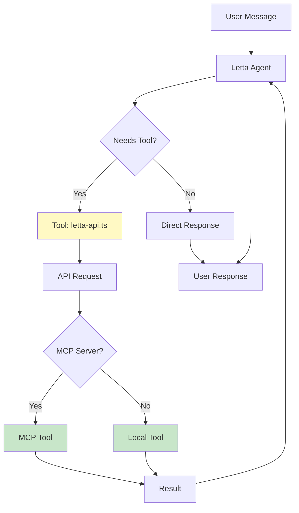

# Letta Architecture - Mermaid Diagrams

## Full System Architecture

```mermaid
flowchart TB
    subgraph Mobile["Mobile Client"]
        App[Letta Mobile App]
        WS[WebSocket Client]
    end

    subgraph Gateway["WS Gateway"]
        WSG[ws-gateway.ts]
        SessionMgr[agent-session-manager]
        ConvStore[(gateway-conversations.json)]
    end

    subgraph LettaServer["Letta Server"]
        API[Letta API]
        Agents[Agents]
        Mem[Memory]
        Tools[Tools]
    end

    App --> WS
    WS <--> WSG
    WSG <--> SessionMgr
    SessionMgr <--> API
    SessionMgr <--> ConvStore
    API <--> Agents
    Agents <--> Mem
    Agents <--> Tools

    style Mobile fill:#e1f5fe
    style Gateway fill:#fff3e0
    style LettaServer fill:#e8f5e9
```

## WebSocket Connection Flow

```mermaid
sequenceDiagram
    participant M as Mobile
    participant G as WS Gateway
    participant SM as Session Manager
    participant L as Letta API

    M->>+G: CONNECT (ws://...)
    G->>+SM: get_or_create_session(conn_id)
    SM->>+L: SDK session pool
    L-->>-SM: session
    SM-->>-G: session_id
    G-->>M: connection ack

    M->>+G: SYNC / history request
    G->>+SM: get_messages(session_id)
    SM->>+L: messages.list()
    L-->>-SM: message history
    SM-->>-G: messages
    G-->>-M: full history

    M->>+G: SUBSCRIBE
    G->>SM: add_listener(session_id, conn)
    Note over M: Live mode

    G-->>M: <real-time events>
```

## Session Pool Architecture

```mermaid
flowchart LR
    subgraph Pool["Session Pool (LRU)"]
        C1[conn-1]
        C2[conn-2]
        Cn[conn-n]
    end

    subgraph Sessions["Per-connection Sessions"]
        S1[(session-1)]
        S2[(session-2)]
        Sn[(session-n)]
    end

    C1 --> S1
    C2 --> S2
    Cn --> Sn

    style Pool fill:#f3e5f5
    style Sessions fill:#fce4ec
```

## Tool Execution Flow

```mermaid
flowchart TD
    A[User Message] --> B[Letta Agent]
    B --> C{Needs Tool?}
    C -->|Yes| D[Tool: letta-api.ts]
    C -->|No| E[Direct Response]
    D --> F[API Request]
    F --> G{MCP Server?}
    G -->|Yes| H[MCP Tool]
    G -->|No| I[Local Tool]
    H --> J[Result]
    I --> J
    J --> B
    E --> K[User Response]
    B --> K

    style D fill:#fff9c4
    style H fill:#c8e6c9
    style I fill:#c8e6c9
```
