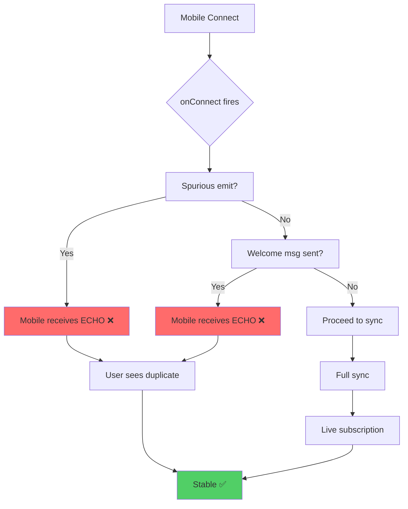

# First Message Echo Bug

## Root Cause

1. `onConnect` fires extra subscription immediately
2. Server sends welcome/ping message on connect
3. Mobile renders ALL incoming messages (no dedupe)

## Fix Options

1. Dedupe by `message_id` client-side
2. Gate welcome msg behind flag
3. Start live sub only AFTER full sync acked
